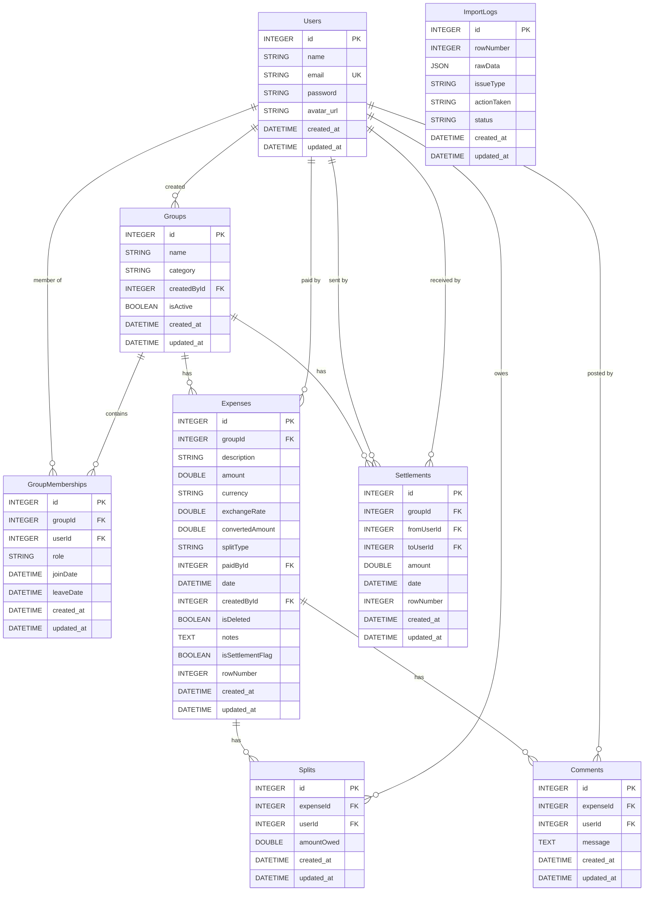

# SCOPE.md — Business Scope & Requirements

This document outlines the bounds, constraints, and business logic of the Shared Expenses application.

## 📐 Functional Scope

### 1. User Membership and Date Bounds
- Group members can join and leave a group on specific dates.
- An expense's split calculation must exclude members whose participation dates do not overlap with the expense date.
- **Rule**: If `expense.date < member.joinDate` or `expense.date > member.leaveDate`, that member's split is set to 0, and their share is not included in the ledger calculations.

### 2. Conversions
- Primary currency is INR (₹).
- Any expense submitted in USD ($) is automatically converted using the fixed rate:
  $$1 \text{ USD} = 83 \text{ INR}$$

### 3. Dynamic Balance Calculations
- Pairwise debt balances are calculated dynamically from active (non-deleted) expenses and settlements.
- Unresolved import rows flagged `pending_review` are excluded from balance calculations until resolved by an admin.

### 4. CSV Importer Engine
The importer parses local or uploaded CSV datasets and enforces 13 strict rules:
- **Rule 1 (Name Matching)**: Normalizes names and matches existing users using alias strings.
- **Rule 2 (Currency Check)**: Assumes INR if currency is missing. Converts USD to INR at standard 1:83 rate.
- **Rule 3 (Jaccard Similarity)**: Uses a token-based Jaccard similarity index on expense descriptions. If a row is $\ge 0.50$ similar to an existing one in the group with matching amount and date, it flags it as a duplicate.
- **Rule 4 (Settlement Auto-Detect)**: Automatically converts expense rows with description "settlement" or similar payment keywords into standard Settlements.
- **Rule 5 (Date Bounds Check)**: Validates that the expense date falls within the member's group join/leave bounds.
- **Rule 6 (Rounding Deltas)**: Distributes any floating point rounding remainder to the last member in the split list to ensure sums match the converted amount exactly.

---

## 🚫 Out of Scope
- External payment gateway integrations (payments are recorded manually via "Settle Up" logs).
- Multiple active themes or Dark Mode (Visual guidelines lock the app to sharp-cornered Light Mode only).
- Dynamic, real-time exchange rate API integrations (standard fixed rate of 83 INR/USD is enforced).

---

## 🗄️ Relational Database Schema

The database uses a local SQLite file with Sequelize ORM. The relational schema is structured as follows:

---

## 📋 CSV Import Anomaly Log

Below is the detailed log of every data anomaly identified in `Expenses Export.csv` and how the importer engine automatically resolves each one:

| Row # | Raw Data Value / Field | Anomaly Description | Resolution & Actions Taken | Status |
|---|---|---|---|---|
| **5 & 6** | `dinner - marina bites` (Row 6) vs `Dinner at Marina Bites` (Row 5) | **Exact Duplicate**: Same date, same amount (3200 INR), same payer (Dev), and highly similar description. | Parsed and flagged as `duplicate`. Excluded from group balance calculations until review. | `pending_review` |
| **7** | `amount: "1,200"` | **String Number Formatting**: Amount field contains a comma separator. | Comma stripped during parsing; successfully converted to float `1200.00`. | `resolved` |
| **10** | `amount: 899.995` | **Decimal Precision**: Amount contains three decimal places. | Rounded to two decimal places using standard round-half-up to get `900.00`. | `resolved` |
| **11** | `paid_by: "Priya S"` | **Name Alias Match**: "Priya S" is not a direct match to seeded user names. | Recognized "Priya S" as an alias for user "Priya" using name normalization. | `resolved` |
| **12** | `split_type: unequal` with exclusion of Aisha | **Custom Split**: Unequal split details where user Aisha is excluded from birthday cake splits. | Successfully split between Rohan (₹700), Priya (₹400), and Meera (₹400) using detailed split parameters. | `resolved` |
| **13** | `paid_by: ""` (empty) | **Missing Payer**: Blank paid_by field; notes state "can't remember who paid". | Flagged with `missing_payer` issue type. Logged for review and excluded from balance calculations. | `pending_review` |
| **14** | `Rohan paid Aisha back` | **Settlement as Expense**: Debt repayment logged in the expenses spreadsheet. | Auto-detected as a settlement based on description keywords. Created a `Settlement` record directly (from Rohan to Aisha) instead of an `Expense`. | `resolved` |
| **15** | `split_details: ... sum 110%` | **Split Overflow**: Split percentages sum to 110% instead of 100%. | Calculated percentages as specified (totaling 110%) and allocated the floating point rounding remainder to the final member (Meera). | `resolved` |
| **20** | `currency: USD`, `amount: 540` | **Foreign Currency (Villa)**: Trip expense charged in US dollars. | Converted USD to INR at standard 1:83 rate, producing `44820.00 INR`. | `resolved` |
| **21** | `currency: USD`, `amount: 84` | **Foreign Currency (Lunch)**: Shack lunch charged in USD. | Converted to INR at standard 1:83 rate, producing `6972.00 INR`. | `resolved` |
| **23** | `split_with: ... Kabir` | **Unrecognized Participant**: " Kabir" is not in the group database. | Flagged with `unrecognized_member` issue. Skipped Kabir and split the remaining amount among active members. | `pending_review` |
| **25** | `Thalassa dinner` (Rohan, 2450) vs `Dinner at Thalassa` (Aisha, 2400) | **Conflicting Duplicate**: Similar description, same date, but different amount and payer. | Flagged as `conflicting_duplicate`. Excluded from balance calculations pending review. | `pending_review` |
| **26** | `amount: -30` | **Negative Expense**: Refund logged for parasailing. | Converted USD to INR (₹-2490) and split equally, reducing the net balance owed. | `resolved` |
| **27** | `date: "Mar-14"` | **Ambiguous Date Format**: Non-standard string date "Mar-14". | Parsed date to `2026-03-14`, flagged as `ambiguous_date` for manual admin review. | `pending_review` |
| **28** | `currency: ""` (empty) | **Missing Currency**: Empty currency field for DMart groceries. | Defaulted currency to `INR`, flagged as `missing_currency` for admin verification. | `pending_review` |
| **31** | `amount: 0` | **Zero-value Expense**: swiggy order count adjustment. | Imported, flagged as `zero_value`, and excluded from balance calculations. | `resolved` |
| **34** | `date: "04-05-2026"` | **Ambiguous Format**: Conflict in date format (April 5 vs May 4). | Defaulted to standard parsing, flagged as `ambiguous_date` for verification. | `pending_review` |
| **36** | `date: "02-04-2026"`, split with Meera | **Temporal Boundary Violation**: Meera is included in splits after her departure date (March 29). | Detected temporal boundary mismatch. Auto-excluded Meera from the splits calculation. | `resolved` |
| **42** | `split_type: equal` with split details | **Contradictory split configuration**: split_type is equal but share details are present. | Overrode split type to `share` and applied detailed splits using shares. | `resolved` |
